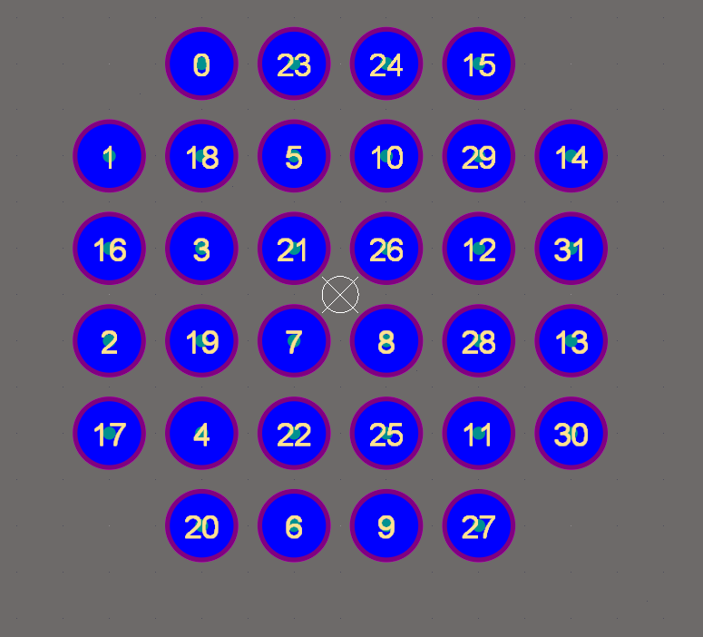
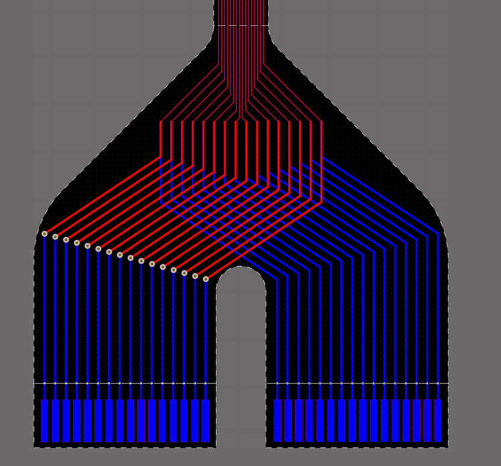
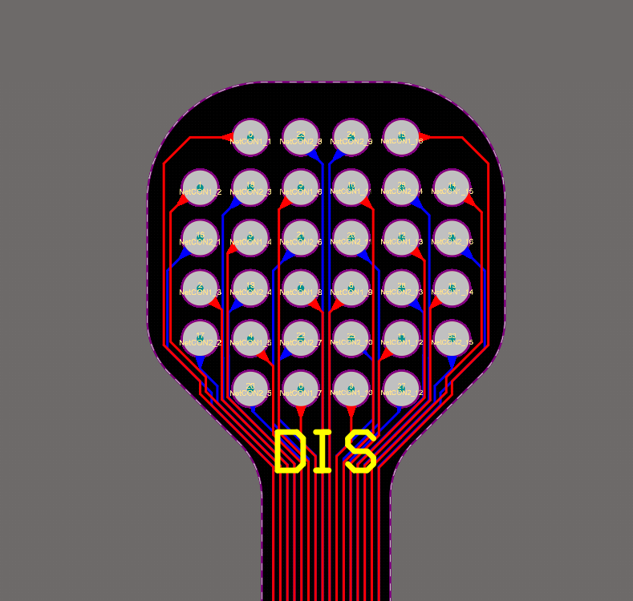

# Finger_E-tactile_Display

**A wearable 32-channel electro-tactile display for fingertip stimulation**

## Overview
This repository contains the hardware design for a **32-channel electro-tactile display** implemented as a **flex PCB**, intended to be worn on the **fingertip pad**.  
The display is designed to be **fully compatible with the open-source [eTactileKit](https://github.com/aid-lab-org/eTactileKit)** ecosystem and integrates directly with its **compact stimulation hardware**.

The form factor and electrical interface are optimized for rapid integration in electro-tactile perception and haptic feedback research.

---

## Key Features
- **32 stimulation electrodes**
- **6 × 6 electrode layout** with four corner electrodes omitted
- **Flex PCB** for comfortable fingertip mounting
- **1.0 mm pitch FFC connector** 
- Direct compatibility with **eTactileKit compact switching boards**
- Designed for **research and experimental use**

---

## Electrode Layout
The electrode array follows a **6 × 6 geometry**, with the four corner positions removed, resulting in **32 active electrodes**.

An annotated image is provided to show the **electrode IDs**, which are intended to be mapped to stimulation channels in software.

---

## Hardware Design
The display is implemented as a **flexible PCB**, optimized for fingertip contact and minimal mechanical strain during wear.

### Connector Region
The board includes a **1.0 mm pitch FFC connector**, allowing it to be **directly connected to the FFC locking connectors** on eTactileKit switching boards.  
This eliminates the need for adapter boards or manual wiring, reducing setup complexity and improving reliability.

### Electrode Region
The electrode region is designed for consistent fingertip contact and spatially localized electro-tactile stimulation.

---

## Compatibility
This display is specifically designed to be used with the **compact PCB designs** in eTactileKit:

- **eTactileKit – Compact PCB Designs**  
  https://github.com/aid-lab-org/eTactileKit/tree/main/1_Hardware/05_Compact_PCB_Designs

The FFC interface enables **direct electrical and mechanical integration** with the switching boards provided in the toolkit.

---

## Intended Use
- Fingertip electro-tactile stimulation
- Haptic perception research
- Sensory substitution and augmentation studies
- Rapid prototyping within the eTactileKit framework

---

## Project Status
**Research / Experimental**

This hardware is intended for research use and prototyping. It has not been certified for medical or commercial applications.

---

## Acknowledgements
This work builds upon the open-source **eTactileKit** framework developed by the AID Lab community.

